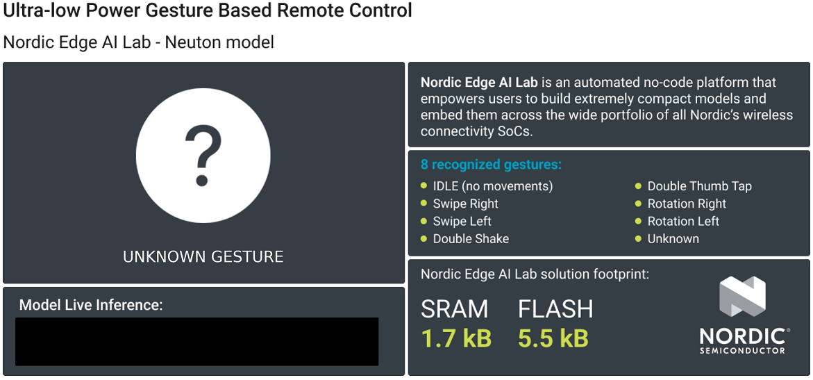

# nRF Edge AI Nordic Thingy:53 Gesture Based BLE Remote Control Device

- [Overview](#overview)
- [Hardware Used](#hw-used)
- [Setup Software Environment](#setup-sw-env)
- [Setup Firmware Project](#setup-fw-proj)
- [Python Demo Setup](#python-demo)
- [How The Project Works](#how-works)
- [Troubleshooting](#troubleshooting)

## Overview <div id='overview'/>

This project demonstrates a gesture based remote control device using [__Nordic Thingy:53__](https://www.nordicsemi.com/Products/Development-hardware/Nordic-Thingy-53). The development kit could be connected to the PC via Bluetooth with custom GATT profile and using BLE characteristic sending recognized gestures. For demonstration of recognized gesture you can use this [python UI demo](#python-demo). Based on accelerometer and gyroscope data the nRF Edge AI model could recognize __8 classes__ of gestures: Swipe Right, Swipe Left, Double Shake, Double Tap, Rotation Clockwise and Counter clockwise, No Gestures(IDLE) and Unknown Gesture. Raw dataset used for model training, which you can use to train your own model, or augment it with your own data and train a more robust model is located [here](https://files.nordicsemi.com/artifactory/edge-ai/external/nordic53thingy_remote_ctrl_train_v101.csv).

[Here](https://docs.google.com/document/d/1UMOTXBaaYdG9_hd3CwTOa2hkph7cb4i2/edit#heading=h.vobk9ee6qydz) you can find a manual on how to create similar solutions on the nRF Edge AI lab from scratch.

## Hardware Used <div id='hw-used'/>

[__Nordic Thingy:53 Multi-protocol IoT prototyping platform__](https://www.nordicsemi.com/Products/Development-hardware/Nordic-Thingy-53)

The Nordic Thingy:53™ is an easy-to-use IoT prototyping platform. It makes it possible to create prototypes and proofs-of-concept without building custom hardware. The Thingy:53 is built around the nRF5340 SoC, the flagship dual-core wireless SoC. The processing power and memory size of its dual Arm Cortex-M33 processors enables it to run embedded machine learning (ML) models directly on the device.

The Thingy:53 also includes many different integrated sensors, like environmental-, and color and light sensors, accelerometers, and a magnetometer, which all can be taken advantage of without additional hardware. It is powered by a rechargeable Li-Po battery that can be charged via USB-C. There is also an external 4-pin JST connector compatible with the Stemma/Qwiic/Grove standards for hardware accessories.


## Setup Software Environment <div id='setup-sw-env'/>

To set this project up, you will need to install the following software:
- Visual Studio Code (https://code.visualstudio.com)
- nRF Connect for VS Code (https://www.nordicsemi.com/Products/Development-tools/nRF-Connect-for-VS-Code)
- [**Optional**] TeraTerm Terminal (https://teratermproject.github.io/index-en.html)

## Setup Firmware Project <div id='setup-fw-proj'/>

1. Clone this repository: https://github.com/Neuton-tinyML/neuton-nordic-thingy53-ble-remotecontrol and checkout to the `feature/custom-ble-gatt` branch. Or run git command `git clone --single-branch --branch feature/custom-ble-gatt https://github.com/Neuton-tinyML/neuton-nordic-thingy53-ble-remotecontrol`
2. In the VS code, `Open folder` where you did clone the repository.

    In nRF Connect tab:

3. `Manage toolchain` install toolchain version **v3.1.0**

4. `Manage SDK` install version **v3.1.0**


4. `Add Build configuration` for Nordic Thingy 53 dev kit


5. Choose `thingy53_nrf5340_cpuapp` in the `Board` selector and click `Build Configuration`


6. After your build will be configured you should see the following options:


7. Now turn on your Thingy 53 dev kit and connect to your PC via debugger and USB


8. Build & Flash the device with firmware


# Python Demo Setup <div id='python-demo'/>

To install and run the UI demo you should have installed:

+ Python 3 and add python3 to your system PATH
+ Pip3 (Python should install it automatically, you can check it with `pip3 --version`)

After installing python3 you can execute `install_demo_win.bat` or run `pip3 install -r requirements.txt`, this script will install all necessary python dependencies for demo application.

To run the UI demo application:
- on Windows you can run `run_demo_win.bat` 
- on Linux/MacOS use the following [manual](demo/README.md)


# How the project works <div id='how-works'/>

Once the application script is running, after approximately 10 seconds you will see **Ready to work** in the console output and the UI application will be running in a dedicated screen.

In the device logs you should see similar messages:

```
nRF Edge AI Nordic Thingy 53 Gestures Recognition Demo:
         Version: 4.0.0
         Solution id: 87008
Bluetooth initialized
Advertising successfully started
```

After Bluetooth connection the device will change LED indication from RED LED glowing to GREEN LED glowing. 


| No Bluetooth connection |  Bluetooth connection established |
| ------------------------ |---------------------------- |
|  | |

After the device is connected a UI Demo window will open


Next, follow the guidelines on how to make gestures bellow. For better recognition use your wrists more when making gestures, and not your whole hand.

__How to Make Gestures__
> **_NOTE:_**  The dataset for creating this model is immature and this affects the generalization of the model on different persons, so please follow the instructions for good gesture recognition.

To begin with, please make sure that the default (initial) position of the device is the same as following:


__Swipe Right & Left__
|                                        |                                               |
| -------------------------------------- | --------------------------------------------- |
|  |         |
| Swipe Right                            |    Swipe Left                                |

__Rotation Clockwise & Counter Clockwise__

|                                           |                                               |
| --------------------------------------    | --------------------------------------------- |
|  |       |
| Rotation Clockwise(Right)                 |    Rotation Counter Clockwise(Left)            |

__Double Shake & Double Tap__

|                                           |                                               |
| --------------------------------------    | --------------------------------------------- |
|    |       |
| Double Shake                              |    Double Tap                              |

When performing gestures with the device, in the python terminal, you should see the similar messages:

```
Ready to work
2,96
SWIPE RIGHT, probability 96 %
3,81
SWIPE LEFT, probability 81 %
2,97
SWIPE RIGHT, probability 97 %
7,86
ROTATION LEFT, probability 86 %
3,99
SWIPE LEFT, probability 99 %
```

The UI demo app will duplicate this with a graphical representation of recongized gestures:


Have fun and use this model for your future gesture control projects!

# Troubleshooting <div id='troubleshooting'/>

### 1. The maximum full path to an object file is 250 characters (see CMAKE_OBJECT_PATH_MAX) on Windows PC

If you notice warnings about `CMAKE_OBJECT_PATH_MAX` during the build process it may lead to subsequent compilation errors. Unfortunately, this is a system setting and the maximum full path length for an object file is defined as 250 characters in the Zephyr build system. So the solution is to reduce the path length and if this is not possible, you might need to maybe restructure your project in order to try reducing the path length. Please refer to https://devzone.nordicsemi.com/f/nordic-q-a/101967/problems-with-long-path-lengths-cmake_object_path_max-errors article.

### 2. Linkage errors: (nrf_edgeai_xxxx.c.obj) uses VFP register arguments, zephyr\zephyr_pre0.elf does not

As we meantioned in [Setup Firmware poject](#setup-fw-proj) section 6.1, nRF Edge AI library compiled with `-mfloat-abi=hard` and you should turn-on FPU via nRF Kconfig GUI or in `thingy53_nrf5340_cpuapp_defconfig`, please refer to 6.1.

### 3. Python demo requirements installation error: bleak-wnrt

On a Windows PC, the Python `bleak` module is installed with `bleak-wnrt`. But `bleak-wnrt` is compiled during installation and required `Microsoft Visual C++ 2015-2022 Redistributable` package. This dependency should be installed in prior of [requirements](demo/requirements.txt) installation on Windows PC.
